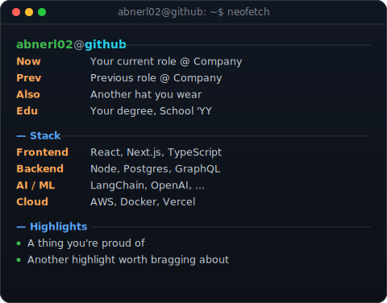

<!--
  This is your PROFILE README. It lives in a repo named exactly AbnerL02
    (github.com/AbnerL02/AbnerL02) so GitHub shows it on your profile.
      Placeholders below (name, tagline, links, info panel) are generic --
        edit them before pushing, or ask me to fill in your real details.
          Portrait was skipped (no photo provided), so this uses the info card only.
          -->
          

          

          ## Abner L.

          **Software Engineer · Builder · Lifelong Learner**

          <!-- Uncomment and fill in once you have real links:
          
          
          
          -->

           

          <!-- animated contribution graph, refreshed daily by the workflow -->
          

          

          
